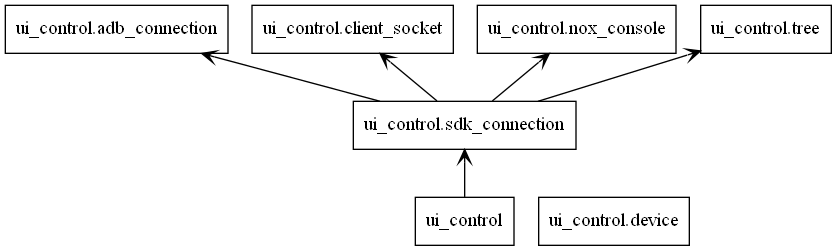

### a wheel of GAutomator：
https://github.com/Tencent/GAutomator

### 使用参考hello_world.py

#
#### 主要改动：
##### 1.支持多进程控制多个设备
##### 2.优化了UI元素的搜索方式
##### 3.加入夜神模拟器的适配
##### 4.删除了不常用的功能，只支持本地运行
##### 分辨率需要适配（未做），默认分辨率1600x900
#
##### 分辨率需要适配（未做），默认分辨率1600x900
#
##### 主要模块：

##### 详细：
